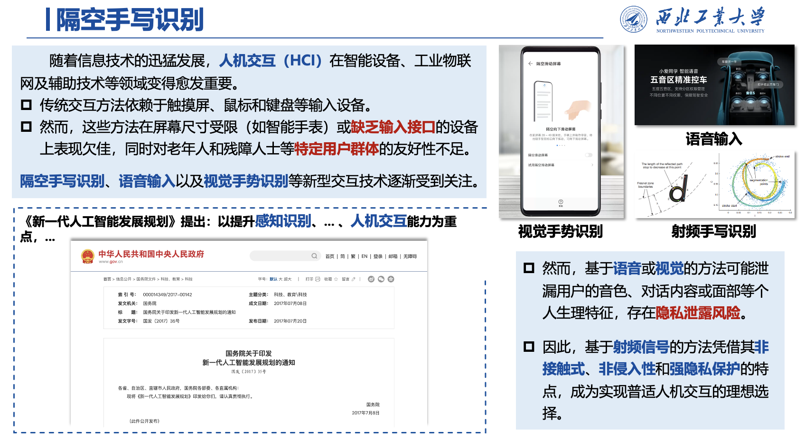
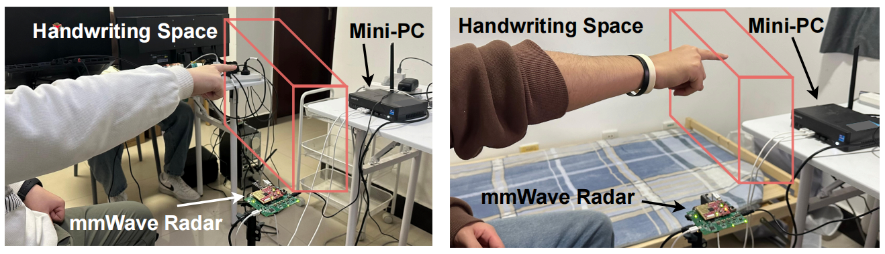
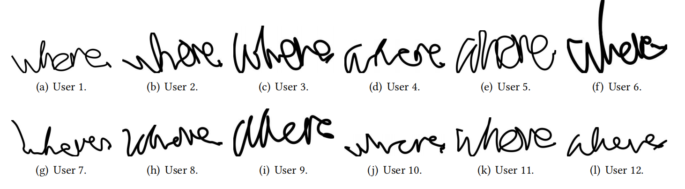
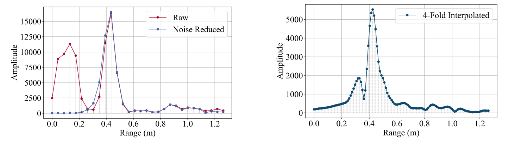
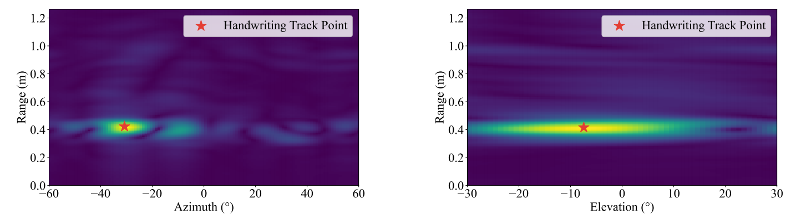
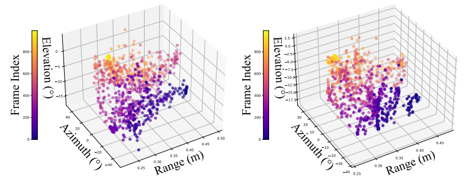
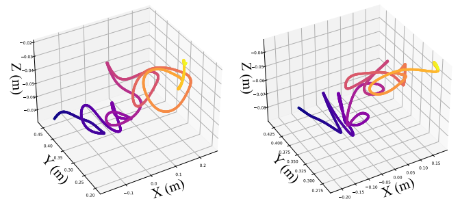
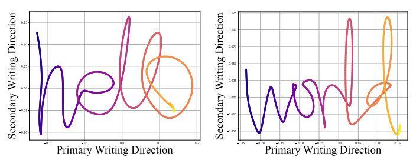
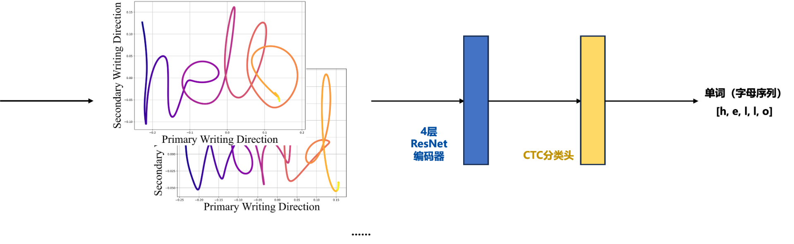

# 基于mmPencil数据集的智能物联网实验课程
> 代码地址（github）：https://github.com/1YifanGuo/NWPU_AIoT_Laboratory

> 数据集地址（kaggle）：https://www.kaggle.com/datasets/mmpencil/mmpencil-dataset/data
***
## 目录
- [三维隔空手写单词毫米波雷达数据集](#1)
- [基于python的毫米波雷达信号处理](#2)
- [基于深度学习的字母级隔空手写单词识别](#3)
  - [方案一：信号 → 频谱 → 单词分类](#3.1)
  - [方案二：信号 → 轨迹图像 → 单词分类 → 语言模型纠错](#3.2)
  - [方案三：信号 → 轨迹图像 → 视觉语言模型单词识别（UbiComp‘25）](#3.3)

***
## 1. ✍ mmPencil-dataset：三维隔空手写单词毫米波雷达数据集 <a id="1"></a>
### ⭐️ 数据集采集背景


### 📦 数据集概述

该数据集包含使用德州仪器IWR6843ISK雷达采集的**三维隔空手写单词数据**，适用于手势识别、手写识别、雷达信号处理和3D轨迹分析等任务。

数据集包含7,744组数据，整体分为三个部分，分别针对不同的研究需求：**词类多样性**、**用户多样性**和**场景丰富性**。


### 🔧 硬件配置
- 雷达: TI IWR6843ISK
- 数据采集板: DCA1000EVM
- 频率范围: 60-64 GHz
- 天线配置: 3个发射天线（一个位于不同高度）+ 4个接收天线
- 视场角: 水平120°，垂直60°
- 频率斜率: 66.011 MHz/μs
- 采样率: 2000 ksps
- 调频配置: 每帧1个调频，每调频108个ADC采样

### 📝 采集模式
- 雷达放置: 固定，朝上
- 用户要求:
    - 自由手写，不限制个人书写风格
    - 不限制笔画顺序或方向
    - 每个字母大约书写2-3秒


- 参与者: 12人（书写风格差异如下图）


- 单词: 200种英文单词（由2-9个字母组成，如下图）


### 📂 数据集组成

**📁 200-Word 4-User 数据集**
- 重点: 广泛的词汇覆盖
- 用户: 4人
- 样本:
    - 用户1 & 2: 每个单词10个样本 × 200个单词
    - 用户3 & 4: 每个单词2个样本 × 200个单词
    - 总样本数: 4,800

**📁 50-Word 12-User 数据集**
- 重点: 用户书写风格多样性
- 用户: 12人
- 内容:
    - 与第一部分重叠的50个单词
    - 包括数字（0-9）和符号（→, +）
- 样本:
    - 用户1 & 2: 每个单词10个样本 × 50个单词
    - 用户3 & 4: 每个单词2个样本 × 50个单词
    - 用户5 - 12: 每个单词4个样本 × 50个单词
    - 总样本数: 3,184（其中1,984个是唯一的）

**📁 22-Scenario 1-User 数据集**
- 重点: 对各种书写条件的鲁棒性
- 场景: 22个（不同的距离、角度、速度、环境等）
- 用户: 1人
- 单词: 每个场景8个单词，每个单词5个样本
- 总样本数: 880

***

## 2. 基于python的毫米波雷达信号处理（隔空手写单词恢复）<a id="2"></a>

### 2.1 导入库和定义函数

```python
import numpy as np
import matplotlib.pyplot as plt
from tqdm import tqdm
from pykalman import KalmanFilter
from sklearn.decomposition import PCA
```
**解释**：这些库分别是用于数值计算、绘图、进度条显示、卡尔曼滤波和主成分分析。

### 2.2 范围FFT（Range FFT）

```python
def range_fft(data: np.ndarray, N: int) -> np.ndarray:
    """
    执行带有零填充和汉明窗的范围FFT。

    参数:
        data (np.ndarray): 输入复数数据，形状为 (n_sample, n_channel)。
        N (int): 零填充的插值因子。

    返回:
        np.ndarray: FFT后的范围轮廓，形状为 (n_sample * N, n_channel)。
    """
    # 验证输入
    if not isinstance(data, np.ndarray) or not np.iscomplexobj(data):
        raise ValueError("Input data must be a complex-valued NumPy array.")
    if not isinstance(N, int) or N <= 0:
        raise ValueError("Interpolation factor N must be a positive integer.")

    # 提取输入数据的维度
    n_sample, n_channel = data.shape

    # 对数据进行零填充
    interpolated_data = np.zeros((n_sample * N, n_channel), dtype='complex')
    interpolated_data[0:n_sample, :] = data

    # 应用汉明窗
    window = np.hanning(n_sample * N)

    # 对每个通道执行FFT
    range_profile = np.zeros((n_sample * N, n_channel), dtype='complex')
    for m in range(n_channel):
        range_profile[:, m] = np.fft.fft(interpolated_data[:, m] * window, n_sample * N)

    return range_profile
```
**解释**：这个函数实现了范围FFT，包括零填充和汉明窗的应用。它返回每个通道的频率域表示。
**频谱细化效果**：

### 2.3 方位角FFT（Azimuth FFT）

```python
def azimuth_fft(range_profile: np.ndarray) -> np.ndarray:
    """
    使用选定的通道和120点FFT执行方位角FFT。

    参数:
        range_profile (np.ndarray): 输入复数数据，形状为 (n_sample, n_channel)。

    返回:
        np.ndarray: FFT后的方位角轮廓，形状为 (n_sample, 120)。
    """
    # 验证输入
    if not isinstance(range_profile, np.ndarray) or not np.iscomplexobj(range_profile):
        raise ValueError("Input range_profile must be a complex-valued NumPy array.")

    n_sample, n_channel = range_profile.shape

    # 定义用于方位角FFT的通道
    selected_channels = [0, 1, 2, 3, 8, 9, 10, 11]
    if max(selected_channels) >= n_channel:
        raise ValueError("Selected channels exceed the available range in range_profile.")

    # 初始化方位角轮廓
    azimuth_profile = np.zeros((n_sample, 120), dtype='complex')

    # 计算每个样本的方位角FFT
    for m in range(n_sample):
        # 提取当前样本的选定通道
        temp = range_profile[m, selected_channels]
        # 执行FFT并应用FFT移位
        azimuth_profile[m, :] = np.fft.fftshift(np.fft.fft(temp, 120))

    return azimuth_profile
```
**解释**：这个函数使用选定的通道对范围轮廓进行方位角FFT，并返回方位角轮廓。

### 2.4 仰角FFT（Elevation FFT）

```python
def elevation_fft(range_profile: np.ndarray) -> np.ndarray:
    """
    使用选定的通道和60点FFT执行仰角FFT。

    参数:
        range_profile (np.ndarray): 输入复数数据，形状为 (n_sample, n_channel)。

    返回:
        np.ndarray: FFT后的仰角轮廓，形状为 (n_sample, 60)。
    """
    # 验证输入
    if not isinstance(range_profile, np.ndarray) or not np.iscomplexobj(range_profile):
        raise ValueError("Input range_profile must be a complex-valued NumPy array.")

    n_sample, n_channel = range_profile.shape

    # 定义用于仰角FFT的通道
    selected_channels = [9, 7]
    if max(selected_channels) >= n_channel:
        raise ValueError("Selected channels exceed the available range in range_profile.")

    # 初始化仰角轮廓
    elevation_profile = np.zeros((n_sample, 60), dtype='complex')

    # 计算每个样本的仰角FFT
    for m in range(n_sample):
        # 提取当前样本的选定通道
        temp = range_profile[m, selected_channels]
        # 执行FFT并应用FFT移位
        elevation_profile[m, :] = np.fft.fftshift(np.fft.fft(temp, 60))

    return elevation_profile
```
**解释**：这个函数使用选定的通道对范围轮廓进行仰角FFT，并返回仰角轮廓。

### 2.5 寻找目标点（Find Target Point）

```python
def find_target_point(map_data: np.ndarray, threshold_ratio: float) -> np.ndarray:
    """
    通过阈值处理和聚类识别地图中的目标点。

    参数:
        map_data (np.ndarray): 表示地图数据的二维数组。
        threshold_ratio (float): 相对于地图最大值的阈值比率。

    返回:
        np.ndarray: 集群中心坐标作为一维数组 [x, y]。
    """
    # 验证输入
    if not isinstance(map_data, np.ndarray) or map_data.ndim != 2:
        raise ValueError("map_data must be a 2D NumPy array.")
    if not (0 < threshold_ratio <= 1):
        raise ValueError("threshold_ratio must be a float in the range (0, 1].")

    # 计算阈值
    threshold = threshold_ratio * np.max(map_data)

    # 查找满足阈值的点的索引
    indices = np.where(map_data >= threshold)
    if len(indices[0]) == 0:
        raise ValueError("No points found above the specified threshold.")

    # 将索引转换为数据点数组
    data_points = np.array(indices).T

    # 计算集群中心（点的均值）
    cluster_center = np.mean(data_points, axis=0)

    return cluster_center
```
**解释**：该函数通过阈值处理和聚类方法找到地图中的目标点，并返回其坐标。
**效果**：


### 2.6 处理帧数据（Process Frame）

```python
def process_frame(transposed_data: np.ndarray,
                  sample_rate: float,
                  c: float,
                  slope: float,
                  n_sample: int,
                  N: int,
                  noise: np.ndarray,
                  target_frames: int) -> np.ndarray:
    """
    处理雷达帧以计算目标在距离、方位角和仰角上的滤波轨迹。

    参数:
        transposed_data (np.ndarray): 转置的输入雷达数据，形状为 (target_frames, n_sample, n_channel)。
        sample_rate (float): 雷达的采样率。
        c (float): 光速（单位：m/s）。
        slope (float): 雷达调频斜率（单位：Hz/s）。
        n_sample (int): 每帧的采样数。
        N (int): 插值因子。
        noise (np.ndarray): 噪声矩阵，与单帧transposed_data的形状相同。
        target_frames (int): 总共要处理的帧数。

    返回:
        np.ndarray: 形状为 (filtered_frames, 3) 的滤波目标位置数据，列分别为 [距离, 方位角, 仰角]。
    """
    # 计算距离分辨率
    range_resolution = sample_rate * c / (2 * slope * n_sample * N)

    # 初始化存储处理数据的空间
    ra_map = np.zeros((target_frames, 30 * N, 120), dtype=np.float32)
    re_map = np.zeros((target_frames, 30 * N, 60), dtype=np.float32)
    location_rae = np.zeros((target_frames, 3), dtype=np.float32)

    # 处理每一帧
    for i in tqdm(range(target_frames), desc="Processing frames"):
        # 距离-方位角和距离-仰角处理
        current_data = transposed_data[i, :, :] - noise
        range_fft_result = range_fft(current_data, N)[:30 * N, :]

        ra_map[i, :, :] = abs(azimuth_fft(range_fft_result))
        re_map[i, :, :] = abs(elevation_fft(range_fft_result))

        # 找到RA和RE地图的集群中心
        cluster_center_ra = find_target_point(ra_map[i, :, :], 0.75)
        cluster_center_re = find_target_point(re_map[i, :, :], 0.75)

        # 计算目标的位置在距离、方位角和仰角上
        location_rae[i, 0] = cluster_center_ra[0] * range_resolution  # 距离（单位：米）
        location_rae[i, 1] = cluster_center_ra[1] - 60  # 方位角
        location_rae[i, 2] = cluster_center_re[1] - 30  # 仰角

    # 过滤轨迹数据中的异常值
    mean_values = np.mean(location_rae, axis=0)
    std_values = np.std(location_rae, axis=0)
    threshold = 3  # 标准差过滤的阈值

    filtered_data = location_rae[
        (np.abs(location_rae[:, 0] - mean_values[0]) <= threshold * std_values[0]) &
        (np.abs(location_rae[:, 1] - mean_values[1]) <= threshold * std_values[1]) &
        (np.abs(location_rae[:, 2] - mean_values[2]) <= threshold * std_values[2])
        ]

    return filtered_data
```
**解释**：此函数处理雷达帧数据，计算目标在距离、方位角和仰角上的滤波轨迹，并返回结果。
**效果**：


### 2.7 平滑和重建轨迹（Smooth and Reconstruct Trajectory）

```python
def smooth_and_reconstruct_trajectory(location: np.ndarray,
                                      use_kalman: bool = True,
                                      kalman_observation_covariance: float = 1.0) -> np.ndarray:
    """
    使用卡尔曼滤波平滑和重建3D轨迹。

    参数:
        location (np.ndarray): 形状为 (n_frames, 3) 的输入轨迹，列分别为 [x, y, z]。
        use_kalman (bool): 是否使用卡尔曼滤波进行平滑。
        kalman_observation_covariance (float): 卡尔曼滤波器观测协方差值。

    返回:
        np.ndarray: 形状为 (n_frames, 3) 的平滑轨迹。
    """
    if not isinstance(location, np.ndarray) or location.ndim != 2 or location.shape[1] != 3:
        raise ValueError("输入 'location' 必须是形状为 (n_frames, 3) 的NumPy数组。")

    if not isinstance(kalman_observation_covariance, (int, float)) or kalman_observation_covariance <= 0:
        raise ValueError("kalman_observation_covariance 必须是正浮点数或整数。")

    # 卡尔曼滤波设置
    kalman_transition_covariance = 1e-3  # 较小的协方差以实现平滑过渡
    smoothed_trajectory = location

    if use_kalman:
        # 初始化卡尔曼滤波器
        kf = KalmanFilter(
            initial_state_mean=[location[0, 0], location[0, 1], location[0, 2], 0, 0, 0],
            transition_matrices=[
                [1, 0, 0, 1, 0, 0],  # 位置x依赖于速度x
                [0, 1, 0, 0, 1, 0],  # 位置y依赖于速度y
                [0, 0, 1, 0, 0, 1],  # 位置z依赖于速度z
                [0, 0, 0, 1, 0, 0],  # 速度x保持不变
                [0, 0, 0, 0, 1, 0],  # 速度y保持不变
                [0, 0, 0, 0, 0, 1]  # 速度z保持不变
            ],
            observation_matrices=[
                [1, 0, 0, 0, 0, 0],  # 观测x
                [0, 1, 0, 0, 0, 0],  # 观测y
                [0, 0, 1, 0, 0, 0]  # 观测z
            ],
            transition_covariance=kalman_transition_covariance * np.eye(6),
            observation_covariance=kalman_observation_covariance * np.eye(3)
        )

        # 应用卡尔曼平滑
        kalman_smoothed, _ = kf.smooth(location)
        smoothed_trajectory = kalman_smoothed[:, :3]  # 提取位置分量 (x, y, z)

    return smoothed_trajectory
```
**解释**：该函数使用卡尔曼滤波器平滑和重建轨迹，以减少噪声影响。
**效果**：


### 2.8 绘制渐变线（Plot Gradient Line）

```python
def plot_gradient_line(ax, x, y, cmap='plasma', linewidth=2):
    """
    在给定的Matplotlib轴上绘制带有渐变颜色效果的线条。

    参数:
        ax (matplotlib.axes.Axes): 要绘制的Matplotlib轴。
        x (array-like): 线条的X坐标。
        y (array-like): 线条的Y坐标。
        cmap (str): Matplotlib配色方案的名称。默认为 'plasma'。
        linewidth (float): 线条宽度。默认为 2。
    """
    # 确保输入有效且长度相同
    if len(x) != len(y):
        raise ValueError("x and y must have the same length.")
    if len(x) < 2:
        raise ValueError("x and y must contain at least two points to plot a line.")

    # 生成渐变颜色
    colormap = plt.colormaps[cmap]
    colors = colormap(np.linspace(0, 1, len(x) - 1))

    # 绘制带有渐变颜色的线段
    for i in range(len(x) - 1):
        ax.plot(x[i:i+2], y[i:i+2], color=colors[i], linewidth=linewidth)
```
**解释**：这个辅助函数用于绘制带有渐变颜色效果的线条，用于可视化轨迹。

### 2.9 可视化2D PCA轨迹（Visualize Trajectory 2D PCA）

```python
def visualize_trajectory_2d_pca(location_ra: np.ndarray) -> None:
    """
    通过PCA投影将3D轨迹（距离，方位角，仰角）可视化为2D。

    参数:
        location_ra (np.ndarray): 形状为 (n_frames, 3) 的输入轨迹，球坐标系中的 (r, 方位角, 仰角)。

    返回:
        None: 显示2D轨迹图。
    """
    # 验证输入
    if not isinstance(location_ra, np.ndarray) or location_ra.ndim != 2 or location_ra.shape[1] != 3:
        raise ValueError("Input 'location_ra' must be a NumPy array of shape (n_frames, 3).")

    # 平滑和重建轨迹
    smoothed_ra = smooth_and_reconstruct_trajectory(location_ra)

    # 将球坐标系 (r, 方位角, 仰角) 转换为笛卡尔坐标系 (x, y, z)
    x_ra = smoothed_ra[:, 0] * np.sin(np.radians(smoothed_ra[:, 1])) * np.cos(np.radians(smoothed_ra[:, 2]))
    y_ra = smoothed_ra[:, 0] * np.cos(np.radians(smoothed_ra[:, 1])) * np.cos(np.radians(smoothed_ra[:, 2]))
    z_ra = smoothed_ra[:, 0] * np.sin(np.radians(smoothed_ra[:, 2]))

    # 堆叠笛卡尔坐标
    cartesian_trajectory = np.vstack((x_ra, y_ra, z_ra)).T

    # 使用PCA将3D轨迹降维到2D
    pca = PCA(n_components=2)
    location_2d = pca.fit_transform(cartesian_trajectory)

    # 确定方向向量（起始点到结束点）在2D中
    start_point = location_2d[0]
    end_point = location_2d[-1]
    direction_vector = end_point - start_point

    # 根据主要书写方向调整方向
    if direction_vector[0] < 0:  # 如果主要方向为负，则翻转X轴
        location_2d[:, 0] = -location_2d[:, 0]
    if direction_vector[1] > 0:  # 如果次要方向为正，则翻转Y轴
        location_2d[:, 1] = -location_2d[:, 1]

    # 绘制2D轨迹
    plt.figure(figsize=(8, 6))
    plot_gradient_line(plt.gca(), location_2d[:, 0], location_2d[:, 1], cmap="plasma", linewidth=6)
    plt.grid(True)

    # 配置轴标签和字体
    plt.xlabel("Primary Writing Direction", fontname='Times New Roman', fontsize=20)
    plt.ylabel("Secondary Writing Direction", fontname='Times New Roman', fontsize=20)

    # 显示图表
    plt.show()
```
**解释**：该函数通过PCA将3D轨迹投影到2D，并使用渐变颜色绘制轨迹。
**效果**：

### 2.10 主程序（Main Program）

```python
if __name__ == '__main__':
    # 定义关键参数
    n_sample = 108  # 每帧的采样数
    n_channel = 12  # 每帧的通道数
    slope = 66.0105e12  # 雷达标频斜率（单位：Hz/s）
    sample_rate = 2e6  # 采样率（单位：Hz）
    N = 4  # FFT插值因子
    c = 3e8  # 光速（单位：m/s）

    # 数据文件路径（注意替换为你的路径）
    file_path = "/kaggle/input/mmpencil-dataset/mmPencil_dataset/User-01/200-Word/about/w04.npy"

    # 加载数据
    try:
        data_cube = np.load(file_path)
    except FileNotFoundError:
        print(f"Error: File not found at {file_path}. Please check the path.")
        exit(1)
    except Exception as e:
        print(f"Error: An unexpected error occurred while loading the file: {e}")
        exit(1)

    # 验证数据维度
    target_frames = data_cube.shape[0]
    if data_cube.ndim != 3 or data_cube.shape[1:] != (n_sample, n_channel):
        print("Error: Data cube dimensions do not match the expected shape (frames, samples, channels).")
        exit(1)

    # 通过帧平均计算静态噪声
    noise = data_cube.mean(axis=0)

    # 处理帧数据并获得目标轨迹
    location_ra = process_frame(data_cube, sample_rate, c, slope, n_sample, N, noise, target_frames)

    # 可视化2D PCA轨迹
    visualize_trajectory_2d_pca(location_ra)
```
**解释**：主程序部分定义了关键参数、加载数据、计算噪声、处理帧数据以获取目标轨迹，并最终可视化2D PCA轨迹。

***

## 3. 基于深度学习的字母级隔空手写单词识别 <a id="3"></a>

### 💡 3.1 方案一：信号 → 频谱 → 单词分类 <a id="3.1"></a>

#### 3.1.1 整体思路
##### 步骤1：信号预处理
- 加载原始`.npy`文件
- 计算噪声基线（所有帧的平均值）
- 从每帧中减去噪声

##### 步骤2：频谱转换
- **Range FFT**：使用Hann窗和零填充，提取180个距离bin
- **Azimuth FFT**：选择特定天线（0,1,2,3,8,9,10,11），计算方位角
- **Elevation FFT**：选择天线9和7，计算俯仰角
- 对每一帧取幅度平均，得到1D频谱

##### 步骤3：特征学习
- 三个独立的Conformer编码器分别处理三个通道
- 融合三路特征（concatenate + 线性变换）
- 最终Conformer编码器提取高级特征

##### 步骤4：序列识别
- CTC层输出每个时间步的字符概率
- 使用贪心解码得到最终单词

#### 3.1.2 模型架构


#### 3.1.3 实验结果
- 基础的200类单词分类实验：**单词准确率：96.88%、字母准确率：99.15%** *（难度⭐⭐）*
- 未见用户实验（用户1-2数据训练，用户3-4数据测试）：**单词准确率：58.25%、字母准确率: 86.05%** *（难度⭐⭐⭐⭐）*
- 未见单词实验（测试集单词未包含在训练集中）：**单词准确率: 38.58%, 字母准确率: 76.26%** *（难度⭐⭐⭐⭐⭐）*

> 方案一教程在：[spectrogram-based_recognition/README.md](https://github.com/1YifanGuo/NWPU_AIoT_Laboratory/blob/main/spectrogram-based_recognition/README.md)
***


### 💡 3.2 方案二：信号 → 轨迹图像 → 单词分类 → 语言模型纠错 <a id="3.2"></a>
#### 3.2.1 整体思路

#### 步骤1:信号预处理
- 加载原始`.npy`文件
- 计算噪声基线(所有帧的平均值)
- 从每帧中减去噪声

#### 步骤2:3D轨迹提取
- **Range FFT**:使用Hann窗和零填充,提取180个距离bin
- **Azimuth FFT**:选择特定天线(0,1,2,3,8,9,10,11),计算方位角
- **Elevation FFT**:选择天线9和7,计算俯仰角
- 对每一帧定位目标,提取3D坐标(距离,方位,俯仰)

#### 步骤3:轨迹平滑与降维
- 使用卡尔曼滤波平滑轨迹,减少噪声
- 球坐标转换为笛卡尔坐标(x,y,z)
- PCA降维到2D平面,保留主要运动方向
- 调整轨迹方向,统一书写方向

#### 步骤4:轨迹图像生成
- 将2D轨迹绘制为黑色线条
- 自适应调整图像边界
- 保存为PNG格式的灰度图像

#### 步骤5:ResNet特征提取
- 加载轨迹图像(调整大小为128×256)
- ResNet提取多尺度特征(layer3 + layer4)
- 特征融合,保留空间信息(2行特征)
- 输出序列特征供CTC使用

#### 步骤6:CTC序列识别
- CTC层输出每个时间步的字符概率
- 使用贪心解码得到最终单词
- (可选)使用语言模型进行拼写纠正

#### 3.2.2 模型架构


#### 3.2.3 实验结果
- 基础的200类单词分类实验：**单词准确率：90.62% → 91.12%（语言模型纠正后）**
- 未见用户实验（用户1-2数据训练，用户3-4数据测试）：**单词准确率：65.25% →69.00%（语言模型纠正后）** 
- 未见单词实验（测试集单词未包含在训练集中）：**单词准确率: 49.92% → 54.50%（语言模型纠正后）** 

> 方案二教程在：[trajectory-based_recognition/README.md](https://github.com/1YifanGuo/NWPU_AIoT_Laboratory/blob/main/trajectory-based_recognition/README.md)
***

### 💡 3.3 方案三：信号 → 轨迹图像 → 视觉语言模型单词识别（UbiComp‘25） <a id="3.3"></a>

> 项目地址（github）：https://github.com/1YifanGuo/mmPencil

> 论文地址（ACM）：https://dl.acm.org/doi/10.1145/3749504  🔗[备用链接](https://www.researchgate.net/profile/Yifan-Guo-61/publication/395263539_mmPencil_Toward_Writing-Style-Independent_In-Air_Handwriting_Recognition_via_mmWave_Radar_and_Large_Vision-Language_Model/links/68e101e9d221a404b2a561bf/mmPencil-Toward-Writing-Style-Independent-In-Air-Handwriting-Recognition-via-mmWave-Radar-and-Large-Vision-Language-Model.pdf)

***

## 📄 Copyright

本教程由西北工业大学计算机学院**智能无线感知小组**开发维护。

**团队介绍:**

智能无线感知小组隶属西北工业大学人机物融合智能计算团队，团队建有人机物融合群智计算教育部重点实验室、智能感知与计算工信部重点实验室、陕西省嵌入系统技术重点实验室等科研平台。

小组负责人[王柱教授](https://jszy.nwpu.edu.cn/wangzhu.html)兼任陕西省嵌入系统技术重点实验室副主任和人机物融合群智计算教育部重点实验室学术秘书。

---
