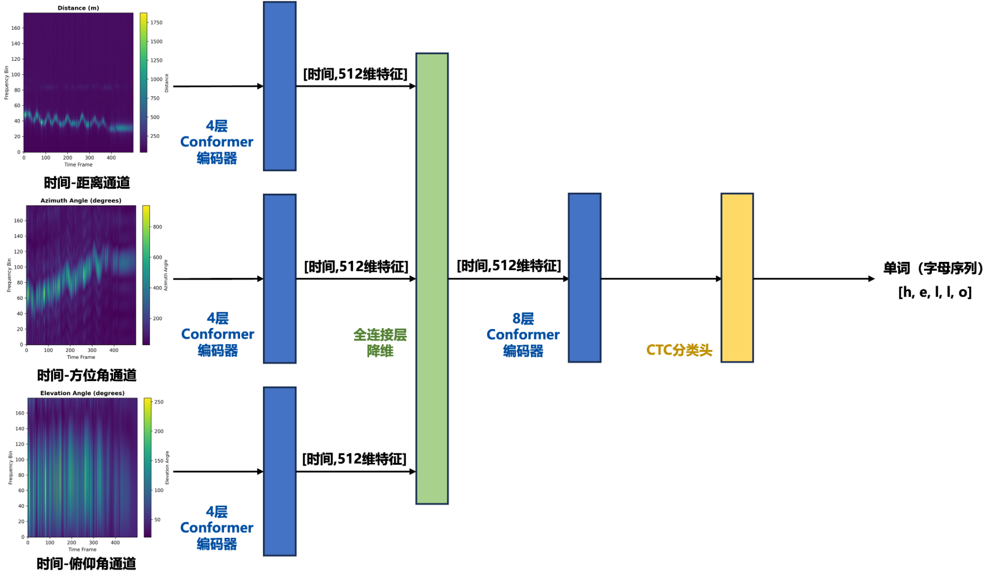

# 毫米波手势识别 - 方案一：频谱图 + Conformer + CTC

## 📚 目录

- [基础知识](#基础知识)
- [整体思路](#整体思路)
- [模型架构](#模型架构)
- [环境配置](#环境配置)
- [使用教程](#使用教程)
- [实验设置](#实验设置)
- [代码结构](#代码结构)

---

## 基础知识

### 1. 毫米波雷达信号

**什么是毫米波雷达？**
- 毫米波雷达发射电磁波，通过接收反射波来感知周围环境
- 可以测量物体的**距离**、**速度**、**角度**等信息
- 不受光照影响，适合全天候工作

**方案一的信号格式：**
- 原始数据：`(帧数, 108采样点, 12通道)` 的复数矩阵
- 每一帧代表一个时间片段的雷达回波
- 12个通道对应雷达的12根天线

### 2. FFT频谱分析

**为什么要做FFT变换？**
- 原始雷达信号在时域，难以直接分析
- FFT将信号转换到频域，可以提取距离、角度等物理信息

**三个维度的FFT：**
1. **Range FFT（距离FFT）**：提取目标距离信息
2. **Azimuth FFT（方位角FFT）**：提取水平方向角度
3. **Elevation FFT（俯仰角FFT）**：提取垂直方向角度

**输出结果：**
- 热图（Heatmap）：`(帧数, 180频点, 3通道)`
- 3个通道分别对应距离、方位、俯仰信息

### 3. Conformer架构

**为什么选择Conformer？**
- Conformer = Transformer（注意力机制）+ CNN（卷积网络）
- **注意力机制**：捕捉长距离依赖关系（比如字母之间的关联）
- **卷积层**：提取局部特征（比如笔画的细节）
- 在语音识别、手势识别等序列任务上表现优异

**Conformer的结构：**
```
输入 → 前馈网络1 → 多头注意力 → 卷积模块 → 前馈网络2 → 输出
```

### 4. CTC损失函数

**什么是CTC？**
- CTC (Connectionist Temporal Classification) 是一种特殊的序列学习方法
- 解决了输入序列和输出序列长度不一致的问题

**为什么需要CTC？**
- 雷达信号有几百帧，但单词只有几个字母
- CTC自动学习"对齐"关系，无需人工标注每一帧对应哪个字母

**CTC的工作原理：**
1. 引入空白符（blank token）
2. 允许输出重复字符
3. 通过动态规划找到最优路径

**举例：**
```
输入序列：[帧1, 帧2, 帧3, 帧4, 帧5, 帧6]
CTC输出： [h, h, -, e, l, l, l, -, o]  （-表示blank）
解码结果： "hello"
```

---

## 整体思路

### 关键步骤说明

#### 步骤1：信号预处理
- 加载原始`.npy`文件
- 计算噪声基线（所有帧的平均值）
- 从每帧中减去噪声

#### 步骤2：频谱转换
- **Range FFT**：使用Hann窗和零填充，提取180个距离bin
- **Azimuth FFT**：选择特定天线（0,1,2,3,8,9,10,11），计算方位角
- **Elevation FFT**：选择天线9和7，计算俯仰角
- 对每一帧取幅度平均，得到1D频谱

#### 步骤3：特征学习
- 三个独立的Conformer编码器分别处理三个通道
- 融合三路特征（concatenate + 线性变换）
- 最终Conformer编码器提取高级特征

#### 步骤4：序列识别
- CTC层输出每个时间步的字符概率
- 使用贪心解码得到最终单词

---

## 模型架构

### 整体架构图



### 详细参数配置

| 模块 | 参数 | 说明 |
|------|------|------|
| **输入层** | - | 180频点 × 3通道 |
| **通道编码器** | 层数=4, 隐藏维度=512 | 每个通道独立编码 |
| **特征融合** | 1536→512 | 拼接后降维 |
| **最终编码器** | 层数=8, 隐藏维度=512 | 提取高级特征 |
| **注意力头数** | 8头 | 每头64维 |
| **前馈维度** | 1024 | 2倍隐藏维度 |
| **卷积核大小** | 31 | 捕获31帧的局部特征 |
| **Dropout** | 0.1 | 防止过拟合 |
| **词汇表** | 28个 | blank + unk + 26个字母 |

### Conformer Block详解

每个Conformer Block包含四个子模块：

```
1. 前馈网络1 (Feed Forward)
   - Linear(512 → 1024)
   - SiLU激活
   - Linear(1024 → 512)
   - Dropout + 残差连接

2. 多头注意力 (Multi-Head Attention)
   - 8个注意力头
   - Q, K, V线性变换
   - 缩放点积注意力
   - Dropout + 残差连接

3. 卷积模块 (Convolution Module)
   - 1D卷积 (升维)
   - GLU门控激活
   - 深度可分离卷积 (kernel=31)
   - BatchNorm + SiLU
   - 1D卷积 (降维)
   - Dropout + 残差连接

4. 前馈网络2 (Feed Forward)
   - 与前馈网络1相同
```

---

## 环境配置

### 系统要求

- **操作系统**: Linux / macOS（不建议） / Windows
- **Python版本**: 3.8+
- **GPU**: NVIDIA GPU (推荐，支持CUDA 11.0+)
- **内存**: 至少16GB RAM
- **硬盘**: 至少10GB可用空间

### 依赖库安装

```bash
# 创建虚拟环境（推荐）
conda create -n mmPencil-spectrogram python=3.8
conda activate mmPencil-spectrogram

# 安装PyTorch（根据你的CUDA版本选择）
# CUDA 11.8版本
pip install torch torchvision torchaudio --index-url https://download.pytorch.org/whl/cu118

# 或者CPU版本（不建议）
pip install torch torchvision torchaudio

# 安装其他依赖
pip install numpy
pip install tqdm
pip install pykalman
pip install scikit-learn
pip install editdistance
```
---

## 使用教程

**下载代码库**

```bash
git clone https://github.com/1YifanGuo/NWPU_AIoT_Laboratory.git
cd NWPU_AIoT_Laboratory/
```

**下载mmpencil数据集**

放置在mmPencil_dataset/mmWave/目录下

### 第一步：数据预处理（信号→频谱图）

**脚本说明：** 第一个代码文件负责将原始毫米波信号转换为频谱图热图。

**输入数据格式：**
```
mmPencil_dataset/mmWave/
├── User-01/
├── User-02/
│   ├── 200-Word/
│   │   ├── about/
│   │   │   ├── w01.npy
│   │   │   ├── w02.npy
│   │   │   └── ...
│   │   └── ...
│   └── ...
└── ...
```

```bash
# 运行FFT转换
python spectrogram-based_recognition/01_signal_to_heatmap.py
```

**输出数据格式：**
```
mmPencil_dataset/mmWave_HotMap/
├── 200-Word_User-01_word1_w01.npy  # shape: (帧数, 180, 3)
├── 200-Word_User-01_word1_w02.npy
└── ...
```

---

### 第二步：数据集划分

**脚本说明：** 第二个代码文件将数据划分为训练集和测试集，支持三种实验设置。

```bash
# 运行数据集划分
python spectrogram-based_recognition/02_dataset_split.py
```

**三种实验设置：**

#### 1. 标准200词识别 (`200-Word.json`)
- **训练集**: 每个单词随机选20个样本 (200×20 = 4000样本)
- **测试集**: 每个单词剩余4个样本 (200×4 = 800样本)
- **目的**: 评估模型在见过的单词上的识别能力

#### 2. 零样本学习 (`zero-shot.json`)
- **训练集**: 150个单词的所有样本 (150×24 = 3600样本)
- **测试集**: 50个单词的所有样本 (50×24 = 1200样本)
- **目的**: 评估模型泛化到新单词的能力

#### 3. 跨用户识别 (`user-split.json`)
- **训练集**: User-01和User-02的所有数据
- **测试集**: User-03和User-04的所有数据
- **目的**: 评估模型跨用户的泛化能力

---

### 第三步：模型训练

**脚本说明：** 第三个代码文件实现完整的训练、测试和推理流程。

#### 基本训练命令

```bash
# 训练200词识别模型
python spectrogram-based_recognition/03_conformer_ctc_train.py --experiment 200word

# 训练零样本学习模型
python spectrogram-based_recognition/03_conformer_ctc_train.py --experiment zero_shot

# 训练跨用户识别模型
python spectrogram-based_recognition/03_conformer_ctc_train.py --experiment cross_user
```

#### 训练参数说明

| 参数 | 默认值 | 说明 |
|------|--------|------|
| `--experiment` | **必需** | 实验类型: 200word / zero_shot / cross_user |
| `--d_model` | 512 | Conformer隐藏层维度 |
| `--n_layers` | 8 | Conformer层数 |
| `--batch_size` | 16 | 批次大小 |
| `--learning_rate` | 1e-4 | 初始学习率 |
| `--num_epochs` | 20 | 训练轮数 |
| `--gpus` | 自动检测 | 使用的GPU数量 |

#### 训练结果

训练完成后，会生成以下文件：

1. **模型文件** (`.pth`)
```
spectrogram-based_recognition/output/
└── mmwave_conformer_ctc_model.pth  # 保存最佳模型
```

模型文件包含：
- `model_state_dict`: 模型权重
- `optimizer_state_dict`: 优化器状态
- `char_to_idx`: 字符到索引的映射
- `config`: 训练配置
- `best_test_acc`: 最佳测试准确率
- `epoch`: 训练轮数

---

### 第四步：模型评估

训练完成后，模型会自动在测试集上进行详细评估，并生成以下指标：

#### 评估指标说明

1. **单词准确率 (Word Accuracy)**
   - 定义：完全正确识别的单词数 / 总单词数
   - 公式：`Acc_word = N_correct / N_total`
   - 示例：预测"hello"，真实"hello" → 正确 ✓

2. **字母准确率 (Character Accuracy)**
   - 定义：基于编辑距离的字符级准确率
   - 公式：`Acc_char = 1 - (总编辑距离 / 总字符数)`
   - 示例：预测"helo"，真实"hello" → 编辑距离=1，字母准确率=4/5=0.8

3. **平均编辑距离 (Average Edit Distance)**
   - 定义：预测单词与真实单词之间的平均编辑操作次数
   - 包括：插入、删除、替换操作
   - 示例：
     - "hello" → "helo": 距离=1 (删除1个l)
     - "world" → "word": 距离=1 (删除1个l)

---

## 实验设置

### 三种实验的详细说明

#### 实验1：标准200词识别

**目标**: 评估模型在已知词汇上的识别能力

**数据划分**:
- 200个单词，每个单词24个样本
- 训练集：每个单词20个样本（共4000样本）
- 测试集：每个单词4个样本（共800样本）

**训练命令**:
```bash
python spectrogram-based_recognition/03_conformer_ctc_train.py --experiment 200word
```

---

#### 实验2：零样本学习

**目标**: 评估模型泛化到新单词的能力

**数据划分**:
- 训练集：150个单词的所有样本（3600样本）
- 测试集：50个新单词的所有样本（1200样本）
- **关键**: 测试集的单词在训练时从未见过

**挑战**:
- 模型需要学习字母级别的特征，而不是记忆单词
- 考验模型的泛化能力

**适用场景**:
- 开放词汇表的手势识别


**训练命令**:
```bash
python spectrogram-based_recognition/03_conformer_ctc_train.py --experiment zero_shot
```

---

#### 实验3：跨用户识别

**目标**: 评估模型跨用户的泛化能力

**数据划分**:
- 训练集：User-01和User-02的所有数据
- 测试集：User-03和User-04的所有数据
- **关键**: 不同用户的书写习惯、手势速度可能不同

**挑战**:
- 用户间的手势差异
- 书写风格的个性化

**适用场景**:
- 多用户共享的手势识别系统
- 无需用户注册的应用

**训练命令**:
```bash
python spectrogram-based_recognition/03_conformer_ctc_train.py --experiment cross_user
```

---

## 代码结构

### 文件组织

```
NWPU_AIoT_Laboratory/
├── mmPencil_dataset/
│   ├── mmWave/                     # 原始雷达数据
│   │   └── 200-Word/
│   │       └── User-XX/
│   │           └── word/
│   │               └── wXX.npy    # (帧数, 108, 12)
│   │               └── ......
│   └── mmWave_HotMap/              # 频谱图数据
│       ├── 200-Word_User-XX_word_wXX.npy  # (帧数, 180, 3)
│       └── ......
│
├── spectrogram-based_recognition/
│   ├── dataset_index/              # 数据集划分JSON文件
│   │   ├── 200-Word.json
│   │   ├── zero-shot.json
│   │   └── user-split.json
│   └── output/                     # 训练输出
│       ├── mmwave_conformer_ctc_model.pth
│       ├── inference_results_conformer_ctc.jsonl
│       └── ......
│
├── 01_signal_to_heatmap.py         # 信号预处理
├── 02_dataset_split.py             # 数据集划分
├── 03_conformer_ctc_train.py       # 训练主程序
└── README.md                       # 本文档
```

---

**祝学业顺利！🎉🎉🎉**

---